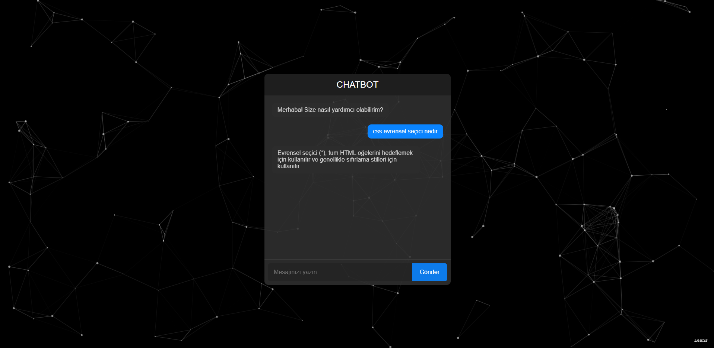

# Chatbot Uygulaması

Bu proje, kullanıcıların bir chatbot ile etkileşimde bulunabileceği basit bir web uygulamasıdır. Chatbot, kullanıcı tarafından girilen mesajlara belirli cevaplar verir ve kullanıcı ile etkileşimde bulunur.

## Özellikler

- **Chat Arayüzü**: Kullanıcıların mesaj gönderip cevap alabileceği bir chat arayüzü sağlar.
- **Chatbot Cevapları**: Belirli sorulara önceden tanımlanmış cevaplar verir.
- **Animasyonlar**: Kullanıcı mesajları ve bot cevapları arasında geçişte animasyonlar bulunur.
- **Sesli Bildirim**: Yeni bir mesaj geldiğinde bildirim sesi çalar.

## Kullanım

1. **Mesaj Gönderme**: Input alanına mesajınızı yazın ve "Gönder" butonuna basın veya Enter tuşuna basarak mesaj gönderebilirsiniz.
2. **Cevap Alma**: Chatbot, mesajınıza uygun cevabı sağ tarafta görüntüler.
3. **Animasyonlar**: Mesaj gönderirken ve alırken animasyonlarla iletişimi daha eğlenceli hale getirir.

## Gereksinimler

- Tarayıcı uyumluluğu: Chrome, Firefox, Safari, vb.
- İnternet bağlantısı gereklidir.

## Kurulum

Projeyi bilgisayarınıza klonlayın:

```bash
git clone https://github.com/leansvia/web-yapay-zeka.git
